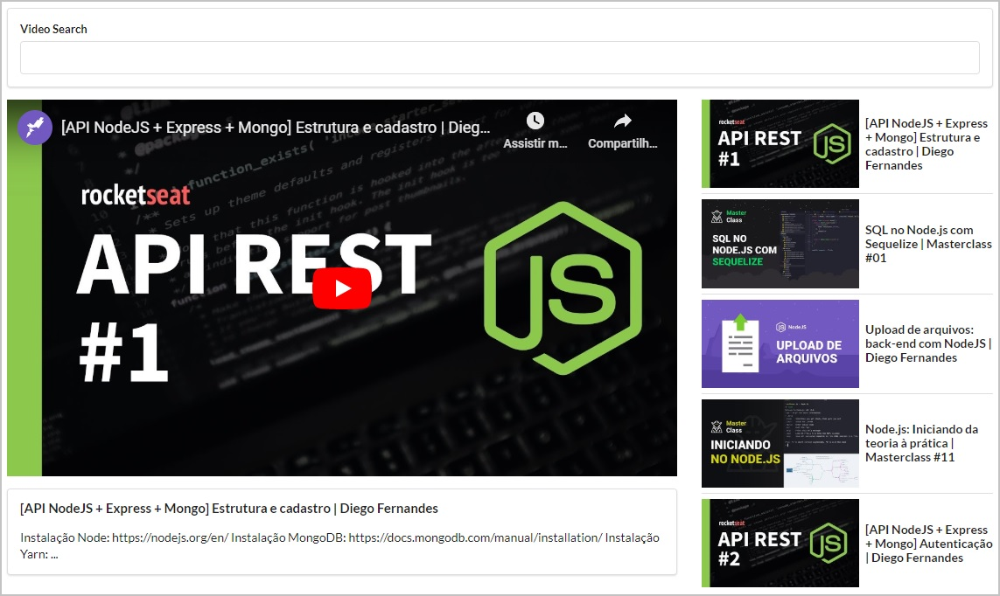

# :play_or_pause_button: Youtube Videos React :clapper:

Clone simples da interface do Youtube usando chamadas assíncronas à API do Youtube.

Utiliza React para criação dessa interface.

Para o correto funcionamento, é necessário utilizar uma Chave de API do Youtube que pode ser obtida conforme manual **[SlickRemix - Get API Key for YouTube](https://www.slickremix.com/docs/get-api-key-for-youtube/)**.

Para maiores informações, acesse: **[Youtube API Key](https://developers.google.com/youtube/registering_an_application?hl=pt-br)**.

Essa chave precisa ser colocada na variável `KEY` em `youtube-video-react/src/components/App.js`.

<p align="center">
  
</p>

### :keyboard: Instalação e Execução

- Clone este repositório

```
> git clone https://github.com/prenato84/youtube-videos-react.git
```

- Acesse a pasta principal do projeto

```
> cd youtube-videos-react
```

- Instale as dependências

```
npm install
```

- Inicie o projeto

```
npm start
```

- Se seu navegador não abrir automaticamente a página do projeto, acesse o endereço `http://localhost:3000/`.

### :man_technologist: Pré-requisitos do Ambiente

- Interpretador Javascript **[Node JS](https://nodejs.org/en/download/)**
- Sistema de versionamento **[Git](https://git-scm.com/)**

OBS: caso não deseje utilizar o Git, pode baixar o projeto diretamente da página do GitHub.

<p align="center">
  
</p>

### :memo: Licença

Esse projeto está sob a licença MIT.

---

Feito com 💜 by <a href="https://www.linkedin.com/in/prenato84">Paulo Castro</a> :wave:
